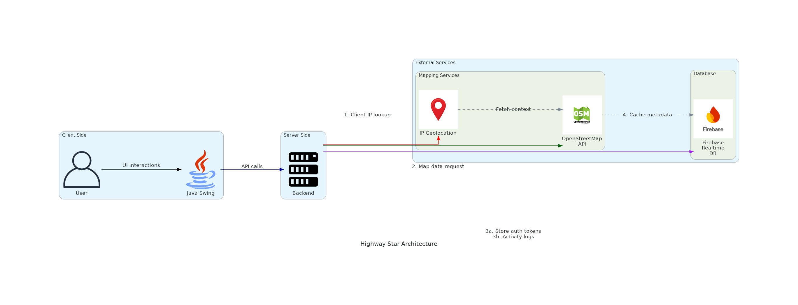

[](https://github.com/gongahkia/highway-star/releases/tag/1.0.0) 

# `Highway Star`

*"We have [Strava](https://www.strava.com/) at home."*

Made to refamiliarise myself with [Java and friends](#stack).

## Stack

* *Frontend*: [Java Swing](https://docs.oracle.com/javase/tutorial/uiswing/index.html)
* *Backend*: [Java](https://www.java.com/en/)
* *DB*: [Firebase Realtime Database](https://firebase.google.com/docs/database)

## Architecture



## Screenshots

...

## Usage

...

Then run the below.

```console
$ git clone https://github.com/gongahkia/highway-star
$ cd highway-star && ./gradlew :app:clean :app:run --no-daemon
```

## Other notes

No hate, but respectfully, [Java Swing]() is [so ugly](https://www.reddit.com/r/javahelp/comments/173nl4d/getting_really_frustrated_with_swing_is_there_a/). I might really have to take [Reddit's advice](https://www.reddit.com/r/JavaFX/comments/18n3sjt/why_javafx_is_still_used_in_2023/) and look into [JavaFX](https://openjfx.io/) instead.

## Reference

The name `Highway Star` is in reference to [Yuya Fungami](https://jojowiki.com/Yuya_Fungami)'s (噴上 裕也) [Stand](https://jojo.fandom.com/wiki/Stand) of the [same name](https://jojowiki.com/Highway_Star) in [Part 4: Diamond is Unbreakable](https://jojowiki.com/Diamond_is_Unbreakable) of the ongoing manga series [JoJo's Bizarre Adventure](https://jojowiki.com/JoJo_Wiki).

<div align="center">
    
</div>