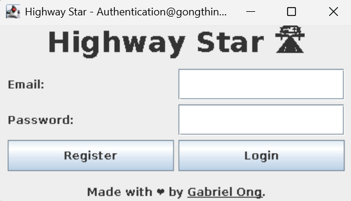
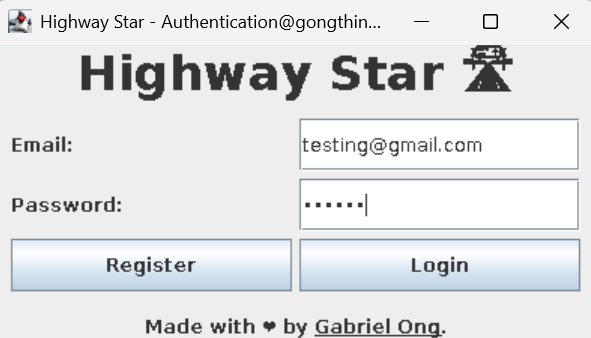
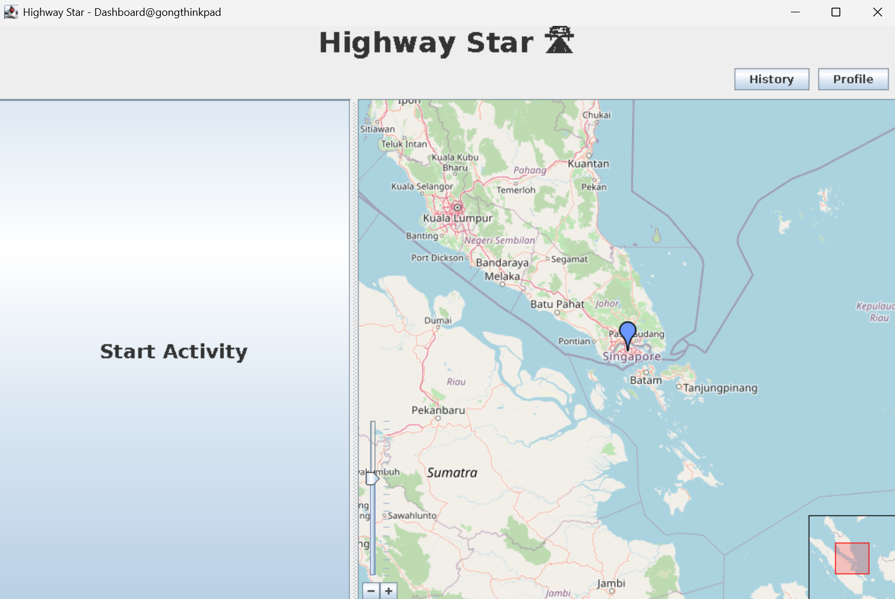
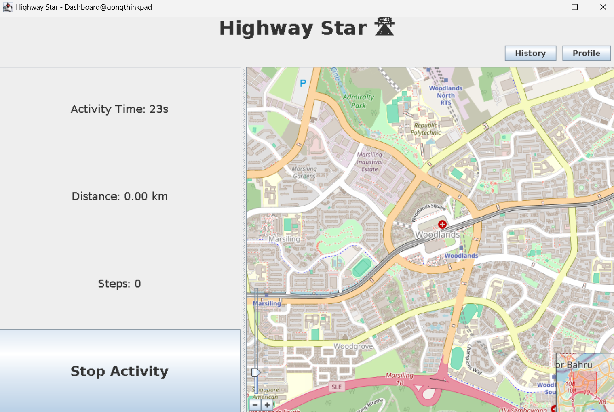
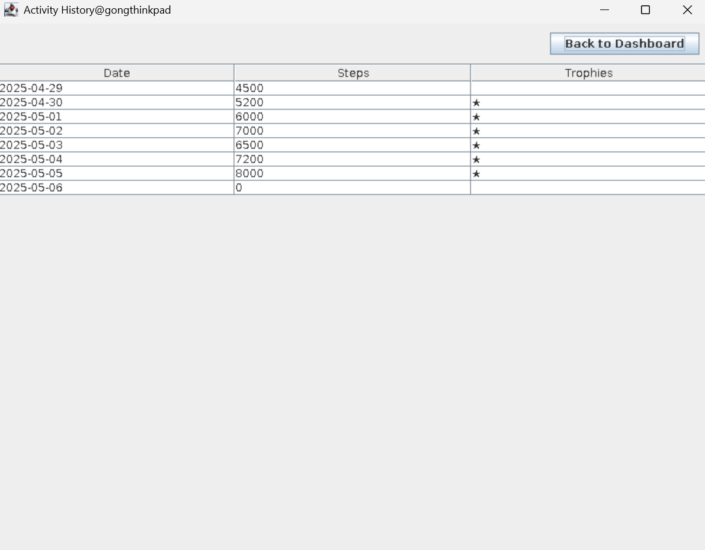
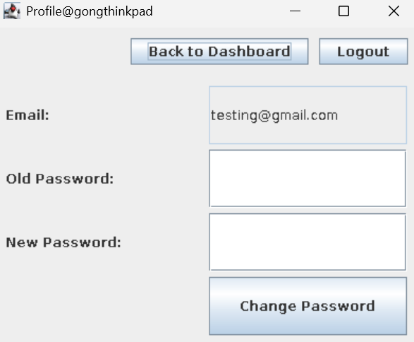

[](https://github.com/gongahkia/highway-star/releases/tag/1.0.0)
[](https://github.com/gongahkia/highway-star/releases/tag/2.0.0)

# `Highway Star`

*"We have [Strava](https://www.strava.com/) at home"*.

Made to refamiliarise myself with [Java and friends](#stack).

## Stack

* *Frontend*: [Java Swing](https://docs.oracle.com/javase/tutorial/uiswing/index.html) with [FlatLaf](https://www.formdev.com/flatlaf/)
* *Backend*: [Java 17+](https://www.java.com/en/)
* *Database*: [Firebase Realtime Database](https://firebase.google.com/docs/database)
* *Maps*: [JXMapViewer2](https://github.com/msteiger/jxmapviewer2) with OpenStreetMap
* *Geolocation*: [MaxMind GeoIP2](https://dev.maxmind.com/geoip/geolite2-free-geolocation-data)
* *Build Tool*: [Gradle](https://gradle.org/)

## Architecture


## Screenshots

### Login/Registration

<div style="display: flex; justify-content: space-between;">
  
  
</div>

### Dashboard

<div style="display: flex; justify-content: space-between;">
  
  
</div>

### Activity History



### Profile Management



## Usage

### Prerequisites
- Java 17 or higher
- Gradle (included via wrapper)
- Firebase account
- (Optional) MaxMind GeoLite2 database for IP geolocation

### Firebase Setup

1. Create a [Google Developer Account](https://developers.google.com/)
2. Create a Firebase project in [Firebase Console](https://console.firebase.google.com)
3. Navigate to *Project Overview > Project settings > Service accounts > Java*
4. Click *Generate new private key*
5. Save the downloaded file to `./highway-star/app/src/main/resources/serviceAccountKey.json`
6. Update the database URL in `Config.java` if needed (default: `https://highway-star-a0d94.firebaseio.com`)

### GeoIP Setup (Optional)

For IP-based geolocation to work:

1. Download GeoLite2 City database from [MaxMind](https://dev.maxmind.com/geoip/geolite2-free-geolocation-data)
2. Extract `GeoLite2-City.mmdb`
3. Place it in `./highway-star/app/src/main/resources/`

Without this file, the app will default to Singapore coordinates.

### Building and Running

```console
$ git clone https://github.com/gongahkia/highway-star
$ cd highway-star
$ make
```

Or using Gradle directly:

```console
$ ./gradlew run
```

To build a distributable JAR:

```console
$ ./gradlew build
$ java -jar app/build/libs/app.jar
```

## Reference

The name `Highway Star` is in reference to [Yuya Fungami](https://jojowiki.com/Yuya_Fungami)'s (噴上 裕也) [Stand](https://jojo.fandom.com/wiki/Stand) of the [same name](https://jojowiki.com/Highway_Star) in [Part 4: Diamond is Unbreakable](https://jojowiki.com/Diamond_is_Unbreakable) of the ongoing manga series [JoJo's Bizarre Adventure](https://jojowiki.com/JoJo_Wiki).

<div align="center">
    
</div>
